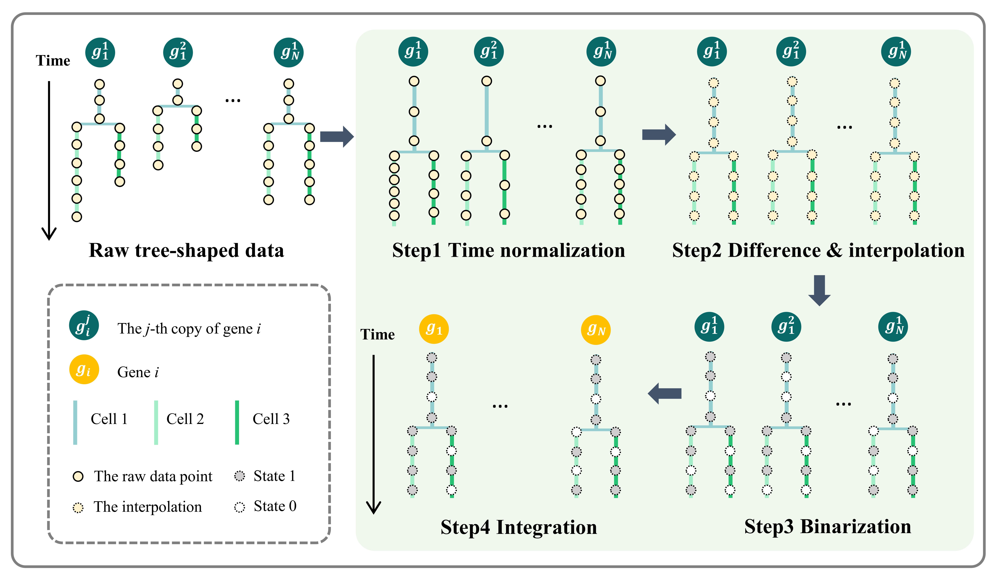

# BBTD
Data and code for paper: Reconstruction of gene regulatory networks for *Caenorhabditis elegans* using tree-shaped gene expression data.

# Data
All real datasets involved in the paper can be downloaded from here. Please put the downloaded `data` file in the root path.

# Tutorial
We provide a tutorial of our work for reproducibility. Please see `./docs/Tutorial.html`.

# License
BBTD is licensed under the GNU General Public License v3.0.

# Reference
Yida Wu, Da Zhou, Jie Hu (2024). Reconstruction of gene regulatory networks for *Caenorhabditis elegans* using tree-shaped gene expression data.

# Contact
If you have any questions about BBTD, please directly contact the corresponding author [Prof. Jie Hu](https://math.xmu.edu.cn/info/1088/11858.htm) with the E-mail: [hujiechelsea@xmu.edu.cn](hujiechelsea@xmu.edu.cn).